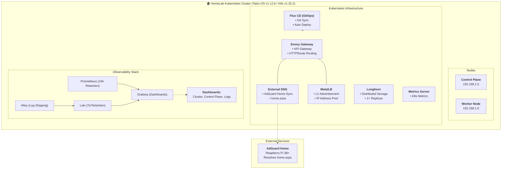

# Homelab Infrastructure

A fully self-hosted Kubernetes cluster running on bare metal with GitOps automation, distributed storage, and comprehensive observability.

## Hardware Overview

### Current Setup
- **2x HP ProDesk 600 G2 Mini**
  - 1x Control Plane (CP) node
  - 1x Worker node
  - Both capable of running workloads
  - Network: Static IP allocation on 192.168.1.0/24

### DNS Infrastructure
- **Raspberry Pi 3B+** running AdGuard Home
  - Home DNS resolver (`home.arpa` domain)
  - Integrated with cluster via External DNS controller
  - Automatic DNS record management for cluster services

### Future Expansion
- Infrastructure designed to scale with additional HP ProDesk 600 G2 Mini nodes
- Distributed storage (Longhorn) currently uses 2-replica replication, easily expandable

---

## Architecture Overview



---

## Technology Stack

### Operating System & Container Runtime
| Component | Purpose |
|-----------|---------|
| **Talos Linux** | Immutable, minimal Linux OS optimized for Kubernetes |
| **Kubernetes** | Container orchestration platform |
| **Kubelet** | Node agent managing containers |

### Infrastructure as Code & Automation
| Component | Purpose |
|-----------|---------|
| **OpenTofu/Terraform** | Infrastructure provisioning and Flux bootstrap |
| **Flux CD**  | GitOps continuous deployment from Git repository |
| **Helm** | Kubernetes package manager |
| **Kustomize** | YAML configuration management |
| **Renovate**  | Automated dependency updates |

### Networking & DNS
| Component  | Purpose |
|-----------|---------|
| **Envoy Gateway**  | API gateway and ingress controller (Gateway API) |
| **MetalLB** | Bare metal load balancer with L2 advertisement |
| **External DNS**  | Automatic DNS record management (integrates with AdGuard Home) |
| **AdGuard Home**  | DNS resolver on Raspberry Pi 3B+, manages home.arpa domains |

### Storage & Data
| Component  | Purpose |
|-----------|---------|
| **Longhorn**  | Distributed block storage with replication (2+ replicas) |
| **MinIO**  | S3-compatible object storage for log aggregation |

### Observability
| Component  | Purpose |
|-----------|---------|
| **Prometheus**  | Metrics collection (24-hour retention, drift detection enabled) |
| **Grafana**  | Metrics visualization with custom dashboards |
| **Loki**  | Centralized log aggregation (7-day retention, 168h TSDB) |
| **Alloy**  | Log shipper collecting logs to Loki |
| **Metrics Server**  | Kubernetes metrics aggregation |

---

## Quick Start

### Prerequisites
- `talosctl` - Talos cluster management CLI
- `kubectl` - Kubernetes CLI
- `tofu` or `terraform` - Infrastructure as Code
- `direnv` (optional) - For automatic environment variable loading
- Network access to 192.168.1.5 and 192.168.1.6

### Initial Cluster Setup

#### 1. Set up environment
```bash
# Load environment variables automatically (if using direnv)
direnv allow

# Or manually export:
export TALOSCONFIG="talos/talosconfig"
export KUBECONFIG="talos/kubeconfig"
```

#### 2. Initialize Talos nodes
See [talos/README.md](talos/README.md) for detailed node initialization steps.

#### 3. Bootstrap Flux with OpenTofu
```bash
cd opentofu

# Initialize OpenTofu
tofu init

# Set up variables (GitHub token and org)
# Edit terraform.tfvars with your GitHub credentials

# Apply bootstrap
tofu apply
```

This will:
- Bootstrap Flux CD into your cluster
- Point Flux to this Git repository
- Begin automatic deployment of infrastructure components

#### 4. Verify cluster health
```bash
# Check node status
kubectl get nodes

# Check Flux synchronization
flux get kustomization

# Check all system namespaces
kubectl get all -A
```

### Network Configuration

**Cluster Network:** `192.168.1.0/24`
- **Control Plane:** `192.168.1.5`
- **Worker Node:** `192.168.1.6`
- **Gateway:** `192.168.1.1`

**DNS Resolution:**
- All services under `*.home.arpa` are automatically registered via External DNS
- AdGuard Home (on Raspberry Pi 3B+) serves as the primary DNS resolver
- Queries are automatically synced from the cluster to AdGuard Home

### Accessing Services

#### HTTP Routes using subdomain of home.arpa
The idea is that for every service that you want to expose (in your local network),
you create an HTTPRoute and external-secrets will automatically manage it to add
the domain to Adguard Home, something like

```
|grafana.homelab.home.arpa^$dnsrewrite=NOERROR;A;192.168.1.201,important
|a-grafana.homelab.home.arpa^$dnsrewrite=NOERROR;TXT;"heritage=external-dns,external-dns/owner=homelab-cluster,external-dns/resource=httproute/monitoring/grafana-route",important
```
This way, using Adguard Home host as your main DNS server, you will be able to resolve these domains withtout having to touch anything else at computer level (since this affects all the network).


#### Cluster Metrics
Access Prometheus and Grafana dashboards:
- **Cluster Dashboard** - Overall cluster health and metrics
- **Control Plane Dashboard** - etcd, API server, and scheduler metrics
- **Logs Dashboard** - Application logs via Loki

---

## GitOps Workflow

This cluster is **fully GitOps managed** via Flux CD:

1. **All infrastructure as code** lives in this repository
2. **Git is the source of truth** - changes are deployed via Git commits
3. **Automated reconciliation** - Flux continuously syncs desired state from Git to cluster

### Making Changes

To deploy or update infrastructure:

```bash
# 1. Make changes to manifests in k8s/
# 2. Commit and push to Git
git add k8s/
git commit -m "Update infrastructure"
git push origin main

# 3. Flux automatically detects and applies changes
# Monitor the sync:
flux get kustomization --watch
```

### Manual Flux Reconciliation
```bash
# Force immediate Flux sync
flux reconcile kustomization flux-system --with-source

# Check sync status
flux get kustomization
```

---

## Storage

### Longhorn Distributed Storage
- **Replication:** Currently 2 replicas across nodes
- **Persistence:** Persistent volumes automatically provisioned for stateful services
- **Mount Point:** `/var/lib/longhorn` on each node

### Expanding Storage
To add storage capacity:
1. Add new HP ProDesk 600 G2 Mini node to cluster
2. Longhorn will automatically detect and use the new capacity
3. Existing volumes can be rebalanced for better distribution

---

## Monitoring & Observability

### Metrics (Prometheus)
- **Retention:** 24 hours
- **Update Interval:** Default scrape interval
- **Enabled:** Drift detection for reliability tracking

### Logging (Loki)
- **Retention:** 7 days (168 hours)
- **Storage Backend:** MinIO S3-compatible storage
- **Log Shipper:** Alloy collects logs from all pods

### Grafana Dashboards
- **Cluster Dashboard** - Node status, pod distribution, resource usage
- **Control Plane Dashboard** - Kubernetes control plane metrics
- **Logs Dashboard** - Centralized log viewing

---

## DNS Management

### AdGuard Home Integration
The cluster uses a **Raspberry Pi 3B+** running AdGuard Home as the DNS authority:

- **Domain:** `home.arpa`
- **Automatic DNS Records:** External DNS controller watches cluster services and automatically creates DNS records in AdGuard Home
- **Service Discovery:** Services are accessible via `<service>.<namespace>.home.arpa`

### Example DNS Records
```
api.default.home.arpa          → 192.168.1.x (MetalLB IP)
grafana.monitoring.home.arpa   → 192.168.1.x (MetalLB IP)
prometheus.monitoring.home.arpa → 192.168.1.x (MetalLB IP)
```

To manage DNS records manually, access AdGuard Home directly on the Raspberry Pi.

---

## Updating & Maintenance

### Talos OS Updates
```bash
# Generate a custom Talos image at https://factory.talos.dev/
# Then upgrade your cluster:
talosctl upgrade --image <factory-url> --nodes <IP>
```

See [talos/README.md](talos/README.md) for detailed upgrade procedures.

### Kubernetes Updates
Kubernetes version updates are managed through Talos. Update the Talos image to upgrade Kubernetes.

### Dependency Updates
- **Renovate** automatically creates pull requests for dependency updates
- Review and merge PRs to apply updates
- Flux automatically deploys merged changes

---

## Architecture Decisions

### Why Talos?
- **Immutable OS:** Prevents configuration drift
- **Minimal footprint:** Designed specifically for Kubernetes
- **Secure by default:** Kubelet runs with SecComp profiles
- **Declarative:** All configuration is YAML-based

### Why Flux CD?
- **GitOps:** Git is the single source of truth
- **Declarative:** Desired state defined in manifests
- **Automatic reconciliation:** Continuously ensures cluster matches Git

### Why Longhorn?
- **Distributed:** Data replication across nodes
- **Resilient:** Automatically handles node failures
- **Easy expansion:** Automatically uses new nodes

### Why Envoy Gateway?
- **Modern:** Based on Kubernetes Gateway API
- **Flexible:** More powerful than traditional Ingress
- **Future-proof:** Industry-standard routing specification

### Why External DNS + AdGuard?
- **Centralized DNS:** Single source of DNS truth
- **Automatic:** Services automatically discoverable without manual DNS management
- **Cost-effective:** Raspberry Pi provides sufficient DNS capacity

---
